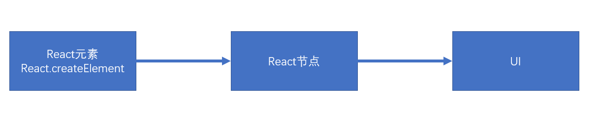
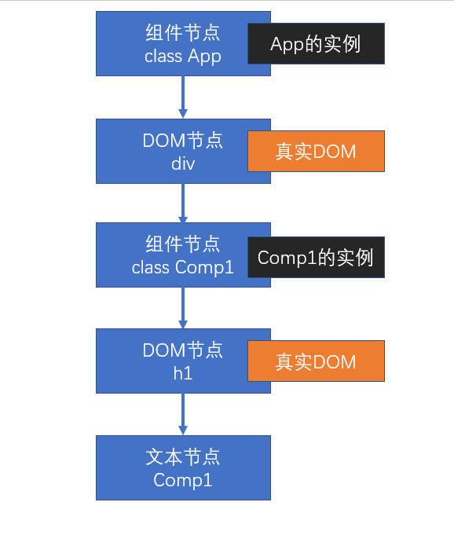

# 渲染原理

渲染：生成用于显示的对象，以及将这些对象形成真实的 DOM 对象
React 元素-> 节点 -> UI


- React 元素：React Element,通过 React.createElement 创建（语法糖 jsx）
- 例如

  ```js
  <div></div>;
  React.createElement(App, null, null);
  ```

- React 节点：专门用于渲染到 UI 界面到对象，React 会通过 React 元素，创建 React 节点
  **ReactDOM** 一定是通过 React 节点来进行渲染的

  - 节点类型：
    - React DOM 节点：创建该节点的 React 元素类型是一个字符串(内置组件)
    - React 组件节点：创建该节点的 React 元素类型是一个函数或者一个类
    - React 文本节点：由字符串，数字创建的
    - React 空节点：由 null undefined false true（不会生成 dom 元素）
    - React 数组节点：该节点由一个数组创建
  - 真实 DOM:通过 document.createElement 创建的 dom 元素

  ## 首次渲染(新节点渲染)

  1. 通过参数的值创建节点
  2. 根据不同的节点，做不同的事情
     1. 文本节点：通过 document.createTextNode 创建真实的文本节点(真实的 DOM)
     2. 空节点：什么都不做
     3. 数组节点：遍历数组，将数组每一项递归创建节点（回到第一步进行反复操作，直到遍历结束）
     4. DOM 节点：通过 document.createElement 创建真实的 DOM 对象，然后立即设置该真实 DOM 元素的各种属性,然后遍历对应 React 元素的 children 属性，递归操作（回到第一步进行反复操作，直到遍历结束）
     5. 组件节点
        1. 函数组件：调用函数(该函数必须返回一个可以生成节点的内容)，将该函数的返回结果递归生成节点
        2. 类组件：
           1. 创建该类的实例（调用构造函数）
           2. 立即调用对象的生命周期方法：static getDerivedStateFromProps
           3. 运行该对象的 render 方法，拿到节点对象（将该节点递归操作，回到第一步进行反复操作，直到遍历结束）
           4. render 执行完后就会将该组件的 componentDidMount 加入到执行队列，当整个虚拟 DOM 树全部构建完毕，并且真实的 DOM 对象加入到容器中后，执行该队列
  3. 生成出虚拟 DOM 树之后，将该树保存起来，以便后续使用
  4. 将之前生成的真实 DOM 对象，加入到容器中

react 元素

```js
const app = (
  <div>
    <h1>
      标题
      {["abc", null, <p>段落</p>]}
    </h1>
    <p>{undefined}</p>
  </div>
);
```

以上代码生成虚拟 DOM 树


函数组件

```js
function Comp1(props) {
  return <h1>Comp1 {props.n}</h1>;
}

function App(props) {
  return (
    <div>
      <Comp1 n={5} />
    </div>
  );
}

const app = <App />;
ReactDOM.render(app, document.getElementById("root"));
```

以上代码生成虚拟 DOM 树


类组件

```js
class Comp1 extends React.Component {
  render() {
    return <h1>Comp1</h1>;
  }
}
class App extends Component {
  render() {
    return (
      <div>
        <Comp1 />
      </div>
    );
  }
}
const app = <App />;
ReactDOM.render(app, document.getElementById("root"));
```

以上代码生成虚拟 DOM 树


## 更新节点

更新的场景：

1. 重新调用 ReactDOM.render,完全重新生成节点树，触发根节点更新
2. 在类组件中调用 setState,会导致该实例所在的节点更新

**节点的更新**

- 如果调用的是 ReactDOM.render, 进入根节点的**对比（diff）更新**
- 如果调用的是 setState
  - 1. 运行生命周期函数 static getDerivedStateFromProps
  - 2. 运行 shouldComponentUpdate,如果该函数返回 false，终止当前流程
  - 3. 运行 render，得到一个新的节点，进入该新的节点的**对比更新** //注意新的节点就是 render 返回的，可能和之前 render 返回的存在一定的差异性
  - 4. 将生命周期函数 getSnapshotBeforeUpdate 加入自己的执行队列，以待将来执行
  - 5. 将生命周期函数 componentDidUpdate 加入自己的执行队列，以待将来执行

后续步骤

- 1. 更新虚拟 DOM 树
- 2. 完成真实的 DOM 更新
- 3. 依次调用执行队列中的 componentDidMount
- 4. 依次调用执行队列中的 getSnapshotBeforeUpdate
- 5. 依次调用执行队列中的 componentDidUpdate

### 对比更新

将新产生的节点，对比之前虚拟 DOM 中的节点，发现差异，完成更新
问题：对比之前 DOM 树中哪个节点
React 为了提高对比效率，做出以下假设

1. 假设节点不会出现层次的移动，（对比时，直接找到旧树中对应位置的节点进行对比）
2. 不同的节点类型会生成不同的结构
   1. 相同的节点类型：节点本身类型相同，如果是由 React 元素生成，type 值必须一致
   2. 其他的，都属于不相同的节点类型
3. 多个兄弟通过唯一标识（key）来确定对比新节点

key 值的作用：用于通过旧节点，寻找对应的新节点，如果某个旧节点有 key 值，则更新时，会寻找相同层级中的相同 key 值的节点，进行对比。

#### 找到了对比的目标

判断节点类型是否一致

- **一致**
  根据不同类型节点，做不同的事情

  **空节点**：不做任何事情
  **DOM 节点**

  1. 直接重用之前的真实 DOM 对象
  2. 将其属性的变化记录下来，以待将来统一完成更新(现在不会真正的变化)
  3. 遍历该新的 React 元素的子元素，**递归对比更新**

  **文本节点**

  1. 直接重用之前的真实 DOM 对象
  2. 将新的文本变化记录下来，将来统一更新

  **组件节点**

  **函数组件**：重新调用函数，得到一个节点对象，进入**递归对比更新**

  **类组件**

  1. 重用之前的实例
  2. 调用生命周期方法 getDerivedStateFromProps
  3. 调用生命周期方法 shouldComponentUpdate,如果该函数返回 false，终止当前流程
  4. 运行 render 得到新的节点对象，进行**递归对比更新**
  5. 将该对象的 getSnapshotBeforeUpdate 加入队列
  6. 将该对象的 componentDidUpdate 加入队列

  **数组节点**：遍历数组进行**递归对比更新**

- **不一致**

整体上，卸载旧的节点，重新创建新的节点
**创建新节点**
进入新节点的挂载流程

**卸载旧节点**

1. **文本节点，DOM 节点，数组节点，空节点，函数组件节点**：直接放弃节点，如果节点有子节点，递归卸载节点
2. **类组件节点**
   1. 直接放弃该节点
   2. 调用该节点的 componentWillUnMount 函数
   3. 递归卸载子节点

#### 没有对比的目标

新的 DOM 树中有节点被删除
新的 DOM 树中有节点添加

- 创建新加入的节点
- 卸载多余的旧节点
